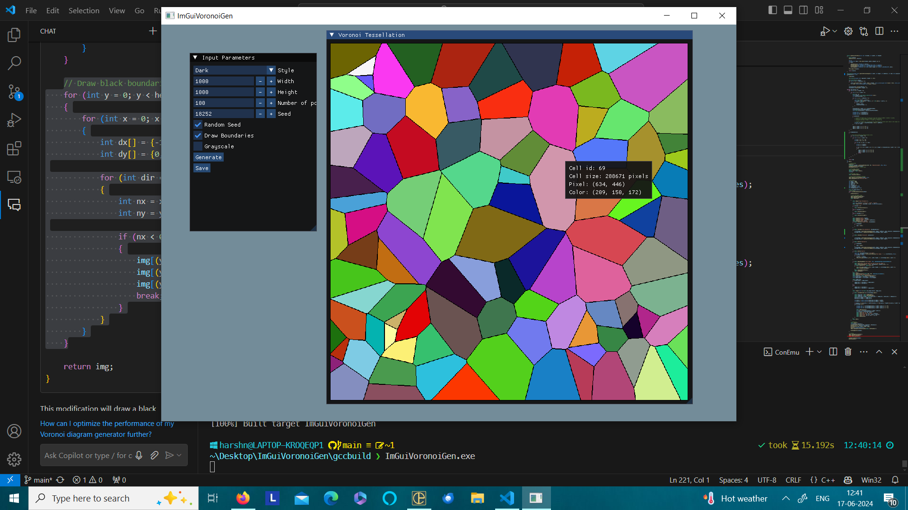

# ImGuiVoronoiGen

ImGuiVoronoiGen is an interactive application for generating and visualizing Voronoi diagrams. It uses the ImGui library for the user interface, allowing users to adjust parameters and see the results in real time. To download the latest binaries for windows x64, go to the [releases](https://github.com/harshn05/ImGuiVoronoiGen/releases) section.

## Getting Started

These instructions will get you a copy of the project up and running on your local machine for development and testing purposes.

### Prerequisites

- CMake
- OpenGL
- GLFW 
- ImGui
- Tinyfiledialogues

### Building

1. Clone the repository:
   ```
   https://github.com/harshn05/ImGuiVoronoiGen.git
   ```
2. Navigate to the project directory:
   ```
   cd ImGuiVoronoiGen
   ```
3. Create a build directory and navigate to it:
   ```
   mkdir build 
   cd build
   ```
4. Run CMake to generate the build files:
   ```
   cmake -DCMAKE_BUILD_TYPE=Release ..
   ```
   Note: for Linux (Ubuntu) install the pre-requisite libs:
   ```
   sudo apt install  libwayland-dev libwayland-bin libxkbcommon-dev libxrandr-dev libxinerama-dev libxcursor-dev libxi-dev
   ```

5. Build the project:
   ```
   cmake --build .
   ```


## Usage

Run the `ImGuiVoronoiGen` executable to start the application. Use the ImGui interface to adjust the parameters for the Voronoi diagram, and click the "Generate" button to generate a new diagram. Save the current diagram to a file by clicking the "Save" button and entering the path where you want to save the image.




## License

This project is licensed under the MIT License - see the [LICENSE.md](LICENSE.md) file for details.